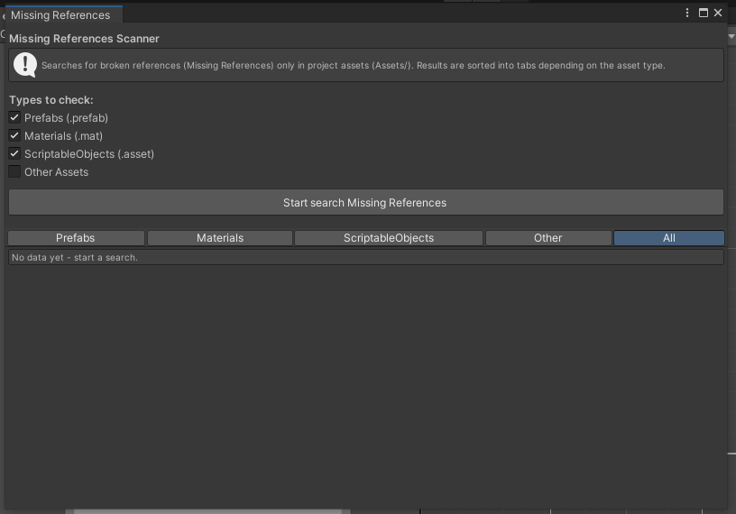

# Missing References Scanner for Unity

## Описание

Missing References Scanner - это Editor Tool для Unity, который сканирует проект и ищет битые ссылки (Missing References) в ассетах.
Инструмент помогает быстро находить объекты, у которых в SerializedProperty обнаружены потерянные ссылки, например после удаления связанных файлов или миграции проекта.
Результаты поиска группируются по типам ассетов Prefab Material ScriptableObject и другие и отображаются во вкладках для удобства.

## Как это работает

Инструмент получает все пути ассетов через AssetDatabase.GetAllAssetPaths ограничиваясь папкой Assets.
Для каждого ассета выполняется загрузка всех вложенных объектов с помощью AssetDatabase.LoadAllAssetsAtPath path.
Создается SerializedObject для каждого из них и происходит перебор всех свойств через prop.NextVisible true.

Если свойство имеет тип ObjectReference и при этом objectReferenceValue равно null а objectReferenceInstanceIDValue не равно 0 это означает что ссылка битая. Unity знает что раньше ссылка указывала на объект но он был удален.

Для каждого найденного случая сохраняется информация о пути к ассету типе объекта пути до поля propertyPath имени родительского префаба если применимо и категории ассета Prefabs, Materials, ScriptableObjects, и т.д.

## Как использовать

В Unity нужно открыть меню Tools - Missing References Scanner.
В появившемся окне выбрать типы ассетов которые нужно сканировать Prefabs, Materials, ScriptableObjects, Other и нажать кнопку Start search Missing References.
После завершения поиска результаты появятся во вкладках по категориям.
Для каждого найденного объекта можно нажать кнопку Show чтобы выделить его в проекте.

## Почему выбран именно этот способ поиска

Существует несколько способов найти missing ссылки в Unity.
- Первый вариант - использовать EditorSceneManager и обход всех GameObject в сценах. Он проверяет только сцены и не работает с ассетами вне сцен.
- Второй способ - использовать AssetDatabase и парсинг YAML файлов. Этот подход медленный и требует ручного разбора текстовых данных.
- Третий вариант - через SerializedObject и SerializedProperty. Именно этот метод используется в инструменте. Он позволяет безопасно обходить сериализованные свойства любых Unity-объектов и получать доступ ко всем ссылкам без парсинга файлов.

Этот способ выбран потому что он универсален подходит для всех ассетов Unity не требует парсинга файлов безопасен в использовании и легко интегрируется в EditorWindow и AssetDatabase.
Он считается наиболее надежным и устойчивым способом проверки битых ссылок в проекте.
